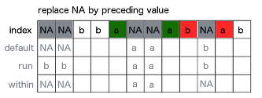

<!-- rmarkdown v1 -->
---
output: 
  github_document:
    toc: true
---

<!-- README.md is generated from README.Rmd. Please edit that file -->


# `runner` an R package for running operations.
[](https://travis-ci.org/gogonzo/runner)
[](http://www.repostatus.org/#active)
[](https://opensource.org/licenses/mit-license.php)
[](https://codecov.io/github/gogonzo/runner?branch=master)

Running functions for R vector written in Rcpp

## Installation

You can install runner from github with:


## Examples
The main idea of the package is to provide running operations on R vectors. Running functions are these which are applied to all elements up to actual one. For example implemented already in `base` `cumsum`, `cummin` etc. Functions provided in this package works similar but with extended functionality such as handling `NA` and custom window size. The most functions provided in package are based on the same logic:  

- `k` window size denotes number of elements from i-th backwards, where functions are calculated.  


- `na_rm` argument handling missing and is equivalent to `na.rm`.


- `na_pad` if window size exceeds number of available elements, than first `k-1` are filled with `NA`.  


- `which` In case of running index, which value ('first' or 'last')


### Creating windows
Function creates list of windows. Because `runner` provide limited functionality, one can create running-window-list which can be further processed by user to obtain desired statistic (eg. window sum). `x` is a vector to be 'runned on' and `k` is a length of window. In this example window length is varying as specified by `k`. Provide one value to obtain constant window size.


```r
library(runner); library(magrittr)
set.seed(11)
window_run( x = 1:5, k = c(1,2,3,3,2) )
#> [[1]]
#> [1] 1
#> 
#> [[2]]
#> [1] 1 2
#> 
#> [[3]]
#> [1] 1 2 3
#> 
#> [[4]]
#> [1] 2 3 4
#> 
#> [[5]]
#> [1] 4 5
```

Such windows can be used in further calculations, with any R function. Example below shows how to obtain running `sum` in specified, varying window length (specified by `k`).


```r
window_run( x= 1:5, k = c(1,2,3,3,2) ) %>%
  lapply(sum) %>%
  unlist
#> [1] 1 3 6 9 9
```
### Unique elements in window
User can use `unique_run` create list of unique elements within specified window size.

```r
x2 <- sample( letters[1:3], 6, replace=TRUE)
x2 
#> [1] "a" "a" "b" "a" "a" "c"
unique_run( x=x2, k = 3 )
#> [[1]]
#> [1] "a"
#> 
#> [[2]]
#> [1] "a"
#> 
#> [[3]]
#> [1] "a" "b"
#> 
#> [[4]]
#> [1] "a" "b"
#> 
#> [[5]]
#> [1] "b" "a"
#> 
#> [[6]]
#> [1] "c" "a"
```

### Running aggregations `(mean|sum|min|max)_run`

Runner provides basic aggregation methods calculated within running windows. Below example showing some functions behaviour for different arguments setup. Let's take a look at 8th element of a vector on which `min_run` is calculated. 
First setup uses default values, so algorithm is looking for minimum value in all elements before actual (i=8). By default missing values are removed before calculations by argument `na_rm=TRUE`, and also window is not specified. The default is equivalent of `base::cummin` with additional option to ignore `NA` values. In second example within window k=5, the lowest value is -3. In the last example minimum is not available due to extistence of `NA`. Graphical example is reproduced below in the code.


```r
x <- c(1,-5,1,-3,NA,NA,NA,1,-1,NA,-2,3)
k <- c(4,5,2,5,4,4,2,2,4,4,3,1)

a0 <- cummin(x)
a1 <- min_run(x, na_rm = TRUE)
a2 <- min_run(x, k=5, na_rm = TRUE)
a3 <- min_run(x, na_rm = FALSE)
a4 <- min_run(x, k=k, na_rm = TRUE, na_pad = TRUE)

data.frame(x, a0, a1, a2, a3, a4)
#>     x a0 a1 a2 a3 a4
#> 1   1  1  1  1  1 NA
#> 2  -5 -5 -5 -5 -5 NA
#> 3   1 -5 -5 -5 -5 NA
#> 4  -3 -5 -5 -5 -5 -5
#> 5  NA NA -5 -5 NA -5
#> 6  NA NA -5 -5 NA -3
#> 7  NA NA -5 -3 NA NA
#> 8   1 NA -5 -3 NA  1
#> 9  -1 NA -5 -1 NA -1
#> 10 NA NA -5 -1 NA -1
#> 11 -2 NA -5 -2 NA -2
#> 12  3 NA -5 -2 NA  3
```


### fill_run
Function used to replace `NA` with previous non-NA element. To understand how `fill_run` works, take a look on ilustration. Row 'x' represents, and another rows represent replaced `NA` by fill_run with different options setup (run_for_first=TRUE and only_within=TRUE respectively). By default, `fill_run` replaces all `NA` if they were preceded by any value. If `NA` appeared in the beginning of the vector then it would not be replaced. But if user specify `run_for_firsty=TRUE` initial empty values values will be replaced by next non-empty value. Option `only_within=TRUE` means that `NA` values would be replaced if they were surrounded by pair of identiacl values. No windows provided in this functionality.




```r
x <- c(NA, NA, "b","b","a",NA,NA,"a","b",NA,"a","b")
data.frame(x, 
           f1 = fill_run(x), 
           f2 = fill_run(x,run_for_first = T), 
           f3 = fill_run(x, only_within = T))
#>       x   f1 f2   f3
#> 1  <NA> <NA>  b <NA>
#> 2  <NA> <NA>  b <NA>
#> 3     b    b  b    b
#> 4     b    b  b    b
#> 5     a    a  a    a
#> 6  <NA>    a  a    a
#> 7  <NA>    a  a    a
#> 8     a    a  a    a
#> 9     b    b  b    b
#> 10 <NA>    b  b <NA>
#> 11    a    a  a    a
#> 12    b    b  b    b
```

### Running streak

To calculate number of consecutive elements one can use `streak_run`. In this case, function doesn't handle `NA` directly 

### Running indexes

To return 


## Benchmarks

Benchmarks comparing base functions with provided in `runner` 

